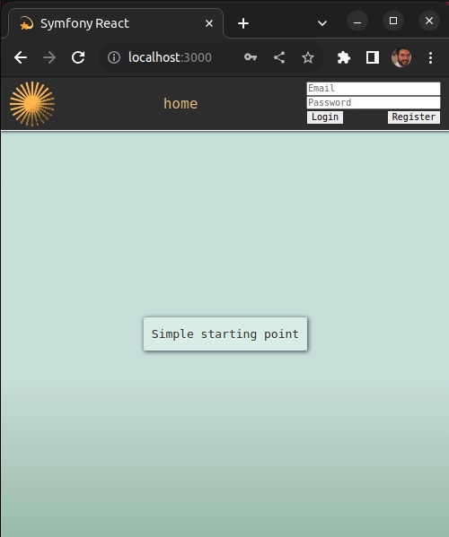
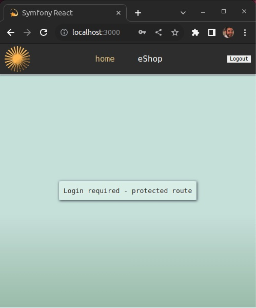
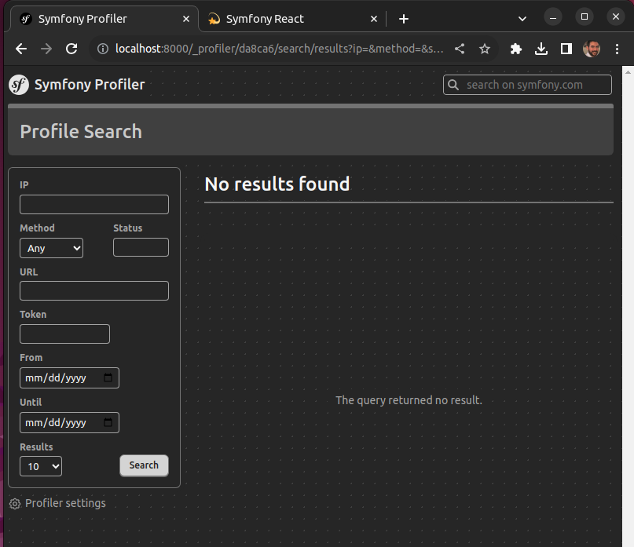

# symfonyReact ⚛

This repository provides a simple yet modern initial setup for full-stack projects, combining the power of JavaScript, React, Firebase, PHP, Symfony, and WebML.

<div align="center">
  
  
</div>

<div align="center">
  
</div>

## Table of Contents

- [Tech-stack Overview](#tech-stack-overview)
- [Getting Started](#getting-started)
- [Prerequisites](#prerequisites)
- [Clone the Repository](#clone-the-repository)
- [Set Your Environment Variables](#set-your-environment-variables)
- [One command to set it all up](#one-command-to-set-it-all-up)
- [Access the App](#access-the-app)
- [Refresh the App](#refresh-the-app)
- [That's it!](#thats-it)

<br />

## Tech-stack overview

- **Backend**: Symfony 6.3 and PHP 8.1
- **Frontend**: React 18.2 and JavaScript
- **Auth**: Firebase Authentication
- **Database**: Firebase Firestore
- **WebML**: Tensorflow.js

<br />

## Getting Started

Follow the steps bellow to set up and run the project on your machine.

<br />

## Prerequisites

Before you begin, ensure you have the following software installed globally on your system, with the recommended minimum versions. The installation process may differ depending on your OS (macOS, Windows, or Linux):

- **Node.js and npm:** Node.js 14 and npm 6 or later

  - [Node.js Download](https://nodejs.org/)
  - _npm is bundled with Node.js, so no separate installation is required._

- **PHP:** PHP 8.1 or later

  - [PHP Download](https://www.php.net/downloads)
  - php8.1-grpc will also need to be installed on your system

- **Composer:** Composer 2.2 or later

  - [Composer Installation](https://getcomposer.org/download/)

- **Symfony CLI:** Symfony CLI 5.5.2 or later
  - [Symfony CLI GitHub](https://github.com/symfony/cli)

<br />

---

### Clone the Repository

<br />

Clone the project repository to your local machine using the following command:

via SSH key :  
`git clone git@github.com:olicoding/symfonyReact.git`

via HTTPS :  
`git clone https://github.com/olicoding/symfonyReact.git`

<br />

---

### Set Your Environment Variables

<br />

You will need to create two `.env` files.

- One for Symfony in the project's **`root` directory**
- One for React inside the **`_frontend` directory**

First, generate your own Symfony app secret by running the following command from a terminal:

> openssl rand -hex 16

Now, create a `.env` file in the project's **`root` directory** with the template bellow:

```
APP_ENV=dev
APP_DEBUG=true
APP_RUNTIME_ENV=dev
APP_SECRET=place_your_generated_secret_here
```

Now, let's move into the **`_frontend` directory**, and create a new `.env` file there with the template bellow:

```
REACT_APP_FIREBASE_API_KEY="API_KEY"
REACT_APP_FIREBASE_AUTH_DOMAIN="AUTH_DOMAIN"
REACT_APP_FIREBASE_PROJECT_ID="PROJECT_ID"
```

And replace the values with the credentials from your Firebase account. If you dont have a Firebase account yet, please [create your own](https://firebase.google.com/). It's free and super simple.

<br />

---

### One command to set it all up

<br />

From the **`root` directory**, run the following command:

> npm run init

( only for the first time when installing the project, it might take a few minutes... but everything is automated for your setup with this single command. )

<br />

---

### Access the app

<br />

Open your browser and navigate to `http://localhost:3000`. The app will proxy requests to the backend automatically.

You can also access the app via backend at `http://localhost:8000`.

Profiler is also set at `http://localhost:8000/_profiler`.

Next time you want to start the project servers for development, run the following command from the **`root` directory**:

> npm run dev

 <br />

---

### Refresh the App

<br />

To synchronize/update changes between React and Symfony during development, run the following command from the **`root` directory**:

> npm run refresh

<br />

---

### That's it!

Enjoy, have fun, and git this repo a ⭐ if you like. 😎

And of course, if you create something amazing with it, I'd be thrilled to have a look!

```
    ('-^-/')
    `o__o' ]
    (_Y_) _/
  _..`--'-.`,
 (__)_,--(__)
     7:   ; 1
   _/,`-.-' :
  (_,)-~~(_,)

 Thank you !!!
```
